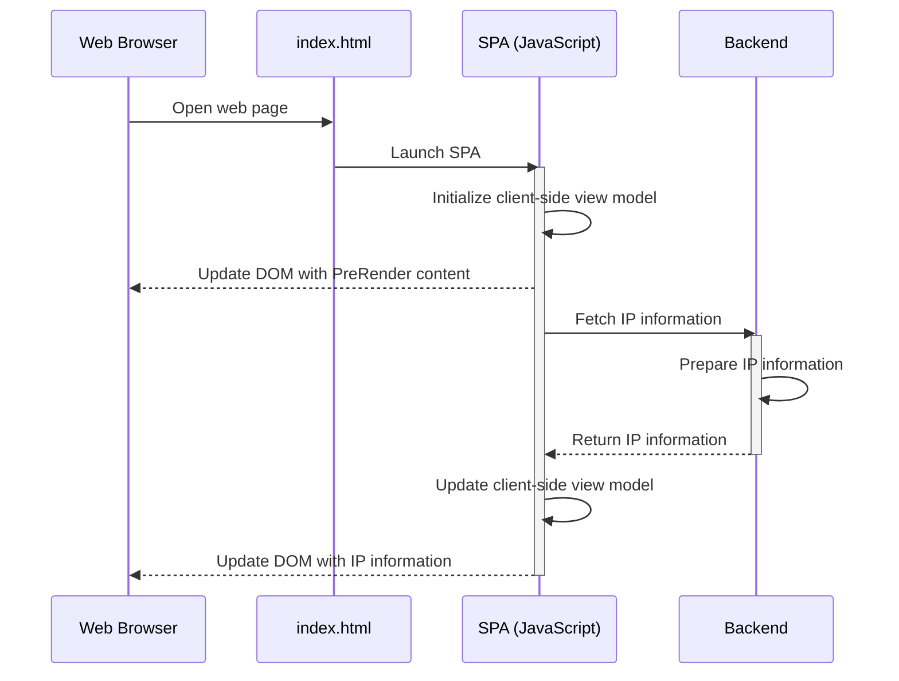

# Frontend of IP detection service

> This project is for demostrate setting up the frontend of an user IP detection service on AWS serverless cloud environment. 

The website frontend is a Single Page Application (SPA) developed with Nuxt.js (Vue.js with Server-Side-Rendering / Page UI components pre-bundling). 

Live Demo: https://demo.weijing329.studio

## Frontend Process Flow Diagram


## Run frontend application locally

``` bash
# Change working directory to this project folder
$ cd nuxt-static-cloudfront-s3-deploy

# install dependencies
$ npm install # Or yarn install

# serve with hot reload at localhost:3000
$ npm run dev
```


## AWS S3 bucket initialization

First, install AWS Command Line Interface Tool as instructed in [Installing the AWS Command Line Interface](https://docs.aws.amazon.com/cli/latest/userguide/installing.html)

```bash
# Login AWS
$ aws configure

# Create S3 Bucket
$ npm run s3CreateBucket
# or
$ aws s3api create-bucket --bucket demo.weijing329.studio --region ap-northeast-1 --create-bucket-configuration LocationConstraint=ap-northeast-1

# Enable S3 Bucket website hosting
$ npm run s3EnableWebsite
# or
$ aws s3 website s3://demo.weijing329.studio --index-document

# Enable S3 Bucket file version control
$ npm run s3EnableVersioning
# or
$ aws s3api put-bucket-versioning --bucket demo.weijing329.studio --versioning-configuration Status=Enabled

# Update S3 Bucket policy to allow only accessed by CloudFront
$ npm run s3UpdatePolicy
# or
$ aws s3api put-bucket-policy --bucket demo.weijing329.studio --policy file://policy.json

# Upload 
$ npm run s3UploadSite
# or
$ aws s3 cp dist s3://demo.weijing329.studio --recursive
```


## Build and upload static website 

Before upload project files to S3 Bucket, source code and static assets will need to bundle into `dist/` folder

``` bash
# Change working directory to this project folder
$ cd nuxt-static-cloudfront-s3-deploy

# generate static project
$ npm run generate 

# Upload to S3 bucket
$ npm run s3UploadSite
# or
$ aws s3 cp dist s3://demo.weijing329.studio --recursive
```

## AWS CloudFront content distribution

Configure CloudFront to delivery static content globaly from S3 website

> This part, I configured through AWS console website. If details are required, I can provide screenshot.
